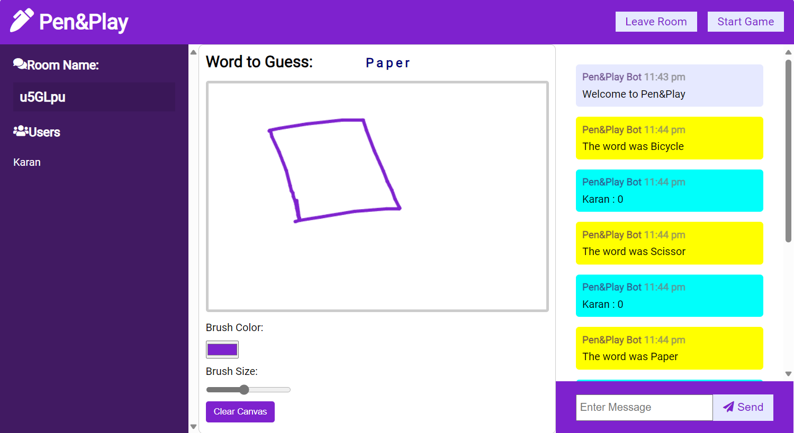

# Pictionary---App

This GitHub repository aims at tracking the development of a Pictionary Game using NodeJs, ExpressJs, and Socket.IO as backend technologies and HTML, CSS, and JavaScript as the frontend technologies.

The work completed till now comprises:

- Creation of the frontend user interface of the game using HTML, CSS, and JavaScript.
- Addition of canvas and its functionalities like brush size, color, and clear canvas to the interface.
- Development of the chat application which enables the users in a room to chat with each other and guess the word depicted by other users by drawing on the canvas.
- Create room functionality and Join room functionality.
- Display the users in a room functionality.
- Turn-based Gameplay added
- Round-based Gameplay functionality added.
- Score calculation functionality added.
- Winner declaration added.
- Responsive layouts ensured.

